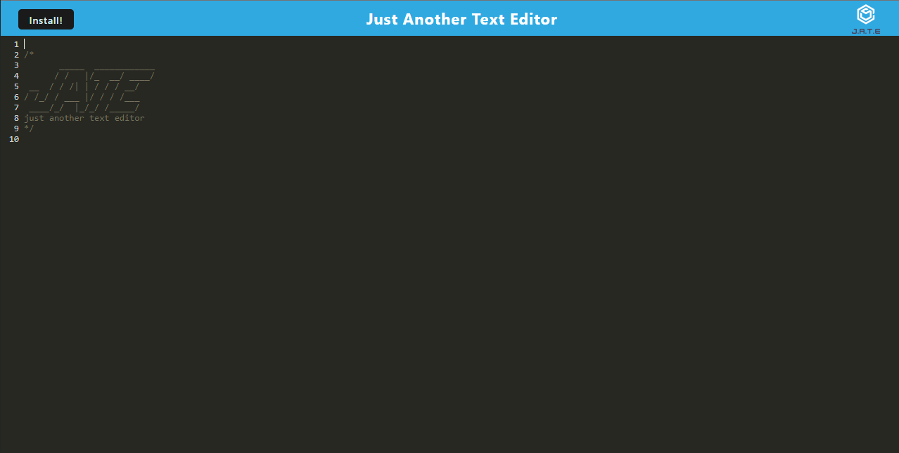

# Text Editor
	

## Description

JATE is just another text editor. It is a PWA that can be installed so users can take notes offline as well. It is a JavaScript app that uses WebPack for PWA configuration.

## Table of Contents

- [Installation](#installation)
- [Usage](#usage)
- [Questions](#questions)

## Installation

The webpage can be visited [here](https://cmseibel-text-editor.herokuapp.com/). Once there, you can install the app by clicking the install button on the top left of the page.

## Usage

Simply type to take notes. Notes will persist and be available even if you close the page. JATE supports JavaScript syntax, so it is an ideal place to take notes for web development.

## Questions

I can be found on GitHub [here](https://github.com/CameronMSeibel).
If you have any questions, I can be reached at cam.m.seib@gmail.com

